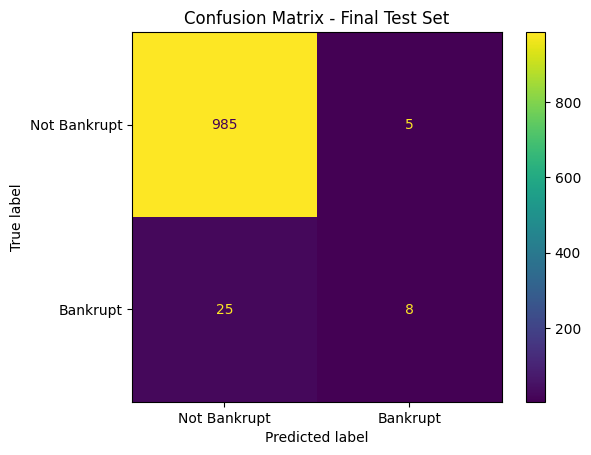
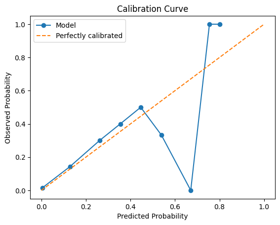
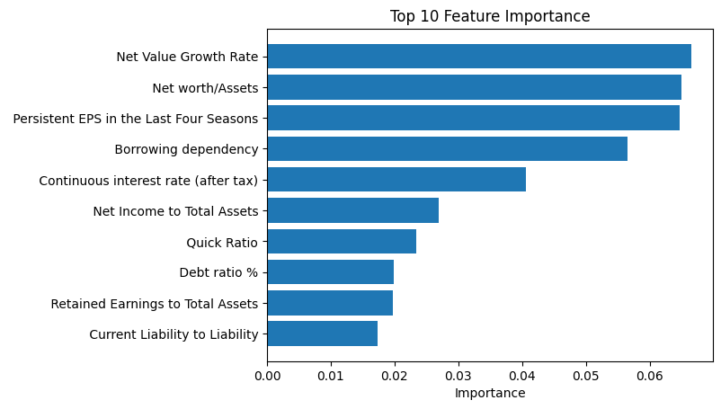

# Assignment 5 Summary

## Problem Statement
- The goal of this project is to predict whether a company will go bankrupt.
- This is a binary classification problem where:
  - 1 = Bankrupt
  - 0 = Not Bankrupt
- Missing a bankrupt company is more costly than incorrectly flagging a healthy company.

---

## Dataset Summary
- The dataset contains financial indicators for companies.
- Most features are numeric.
- Minimal preprocessing was required.
- The dataset is highly imbalanced.

---

## Class Imbalance
- Approximately 3% of companies are bankrupt.
- Accuracy is not a reliable metric.
- The focus is on correctly identifying the minority class.

---

## Metrics Used
- **PR-AUC**: Primary metric for model selection (focus on rare positive class).
- **Brier Score**: Measures the quality of predicted probabilities.
- Additional metrics:
  - ROC-AUC
  - Precision
  - Recall
  - F1-score

---

## Feature Selection
- Feature Set A: All available features.
- Feature Set B: Top 25 features selected using XGBoost feature importance.
- Feature Set B reduces complexity but slightly decreases performance.

---

## Experiment Results

| Exp | Model                      | Feature Set | Val PR-AUC | Val Brier | Overfit Gap | Selected |
|-----|----------------------------|------------|------------|-----------|-------------|----------|
| 1   | Logistic Regression        | A          | 0.043      | 0.043     | Low         | No       |
| 2   | XGBoost Baseline           | A          | 0.488      | 0.023     | High        | No       |
| 3   | XGBoost (Imbalance)        | A          | 0.494      | 0.023     | High        | No       |
| 4   | XGBoost Tuned              | A          | 0.598      | 0.020     | Medium      | Yes      |
| 5   | XGBoost Selected Features  | B          | 0.457      | 0.022     | High        | No       |

---

## Winning Model
- The selected model is **XGBoost Tuned (Experiment 4)**.
- It achieved:
  - Highest validation PR-AUC
  - Lowest Brier score
  - Best overall performance

---

## Final Test Results
- PR-AUC: (o.5209)
- ROC-AUC: (0.9586)
- Brier Score: (0.00224)
- Precision: (0.6154)
- Recall: (0.2424)
- F1-score: (0.3478)

The model maintains good performance on the test set, indicating reasonable generalization.

---

## Confusion Matrix

- The model correctly identifies some bankrupt companies.
- Some bankrupt companies are still missed due to class imbalance.
- This reflects the tradeoff between precision and recall.

---

## Calibration Result

- The calibration curve is close to the diagonal.
- Predicted probabilities generally match observed outcomes.
- Some overconfidence is observed in certain ranges.
- The model is still effective for ranking risk.

---

## Feature Importance

- The most important features are financial indicators.
- This aligns with expectations for bankruptcy prediction.
- Limitation:
  - Feature importance does not show direction or interactions.

---

## Overfitting Discussion
- Training PR-AUC is much higher than validation PR-AUC.
- This indicates some overfitting.
- Light tuning reduced overfitting but did not eliminate it.

---

## Conclusion
- XGBoost significantly outperforms Logistic Regression.
- Proper metrics (PR-AUC and Brier score) are essential for imbalanced data.
- The final model is effective for ranking companies by risk.
- Calibration is acceptable but can be improved.
- Overall, the model is suitable for identifying high-risk companies.

---

## AI Usage
- AI tools (Codex) were used to:
  - Generate evaluation functions
  - Assist with debugging
  - Improve code structure
- All generated code was reviewed and modified as needed.
- Final decisions were based on understanding of the assignment.